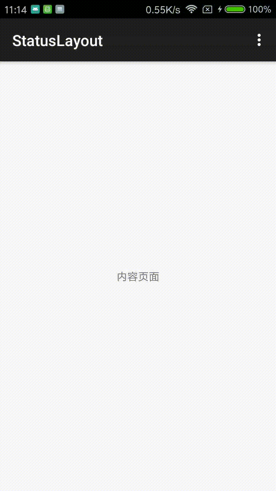

# StatusLayout
[](https://www.jitpack.io/#F1ReKing/StatusLayout)
[](https://github.com/F1ReKing/StatusLayout/blob/master/LICENSE)
[](https://android-arsenal.com/api?level=16)

一个在Android上可切换数据状态的布局，包含了加载布局，空数据布局，错误布局

## 特性

1. 支持链式调用
2. 支持动态切换加载，空数据，错误，内容布局
3. 懒加载布局，没有布局层叠问题
4. 支持点击监听事件处理

## 预览图

<a href="art/statusLayout.gif"></a>

## 引入

#### Step 1. Add the JitPack repository to your build file

```
allprojects {
	repositories {
		...
		maven { url 'https://www.jitpack.io' }
	}
}
```

#### Step 2. Add the dependency

```
dependencies {
       compile 'com.github.F1ReKing:StatusLayout:1.2.1'
}
```

## 使用

#### 快速用法

- kotlin用法

  ```Kotlin
  private lateinit var mStatusLayout: StatusLayout

  mStatusLayout = StatusLayout.Builder(congtentLayout)
          .setOnStatusClickListener(object : StatusClickListener {
            override fun onEmptyClick(view: View) {
            }

            override fun onErrorClick(view: View) {
            }
          })
          .build()
  ```

- Java 用法

  ```java
  private StatusLayout mStatusLayout;

  mStatusLayout =
     new StatusLayout.Builder(congtentLayout).setOnStatusClickListener(new StatusClickListener() {
            @Override
            public void onEmptyClick(View view) {
            }

            @Override
            public void onErrorClick(View view) {
            }
          }).build();
  ```

- 统一调用

  ```java
  //显示内容布局
  mStatusLayout.showContentLayout();
  //显示加载中布局
  mStatusLayout.showLoadingLayout();
  //显示数据空布局
  mStatusLayout.showEmptyLayout();
  //显示数据错误布局
  mStatusLayout.showErrorLayout();
  ```

#### API

1. 配置布局

   **注意：自定义layout中id必须与lib中一致**

   | 方法名                                      | 说明       | layout中ID                                |
   | ---------------------------------------- | -------- | ---------------------------------------- |
   | setOnLoadingLayout(@LayoutRes loadingLayoutID: Int) | 配置加载布局   | tv_status_loading                        |
   | setOnLoadingLayout(loadingLayout: View)  | 配置加载布局   | tv_status_loading                        |
   | setOnEmptyLayout(@LayoutRes emptyLayoutID: Int) | 配置数据空布局  | iv_status_empty<br />tv_status_empty<br />tv_click_empty |
   | setOnEmptyLayout(emptyLayout: View)      | 配置数据空布局  | iv_status_empty<br />tv_status_empty<br />tv_click_empty |
   | setOnErrorLayout(@LayoutRes errorLayoutID: Int) | 配置数据错误布局 | iv_status_error<br />tv_status_error<br />tv_click_error |
   | setOnErrorLayout(errorLayout: View)      | 配置数据错误布局 | iv_status_error<br />tv_status_error<br />tv_click_error |

2. 配置文字、字体颜色等属性

   | 方法名                                      | 说明           |
   | ---------------------------------------- | ------------ |
   | setOnLoadingText(loadingText: String)    | 设置加载提示文字     |
   | setOnLoadingtext(@StringRes loadingTextStringRes: Int) | 设置加载提示文字     |
   | setOnLoadingTextColor(loadingTextColorRes: Int) | 设置加载提示文字颜色   |
   | setOnEmptyText(emptyText: String)        | 设置数据空提示文字    |
   | setOnEmptyText(@StringRes emptyTextStringRes: Int) | 设置数据空提示文字    |
   | setOnEmptyClickText(emptyClickText: String) | 设置数据空点击文字    |
   | setOnEmptyClickText(@StringRes emptyClickTextStringRes: Int) | 设置数据空点击文字    |
   | setOnEmptyTextColor(emptyTextStringRes: Int) | 设置数据空提示文字颜色  |
   | setOnEmptyClickTextColor(emptyClickTextColorRes: Int) | 设置数据空点击文字颜色  |
   | setOnErrorText(errorText: String)        | 设置数据错误提示文字   |
   | setOnErrorText(@StringRes errorTextStringRes: Int) | 设置数据错误提示文字   |
   | setOnErrorClickText(errorClickText: String) | 设置数据错误点击文字   |
   | setOnErrorClickText(@StringRes errorClickTextStringRes: Int) | 设置数据错误点击文字   |
   | setOnErrorTextColor(errorTextStringRes: Int) | 设置数据错误提示文字颜色 |
   | setOnErrorClickTextColor(errorClickTextColorRes: Int) | 设置数据错误点击文字颜色 |

3. 配置图片

   | 方法名                                      | 说明       |
   | ---------------------------------------- | -------- |
   | setOnEmptyImg(@DrawableRes emptyImgID: Int) | 设置数据空图片  |
   | setOnErrorImg(@DrawableRes errorImgID: Int) | 设置数据错误图片 |

   ​

## 版本开发记录

#### v1.2.1

- 修改方法名，避免与kotlin语法冲突

#### v1.2.0

- 添加了能修改加载布局提示字体颜色

#### v1.1.1

- 更改包名

#### v1.1.0

- 新增修改字体颜色

#### v1.0.1

- 优化布局和功能

#### v1.0

- 初始化提交
- 支持加载布局，空数据布局，出错布局


## License

```
Copyright 2018 F1ReKing. 

Licensed under the Apache License, Version 2.0 (the "License");
you may not use this file except in compliance with the License.
You may obtain a copy of the License at

   http://www.apache.org/licenses/LICENSE-2.0

Unless required by applicable law or agreed to in writing, software
distributed under the License is distributed on an "AS IS" BASIS,
WITHOUT WARRANTIES OR CONDITIONS OF ANY KIND, either express or implied.
See the License for the specific language governing permissions and
limitations under the License.
```

